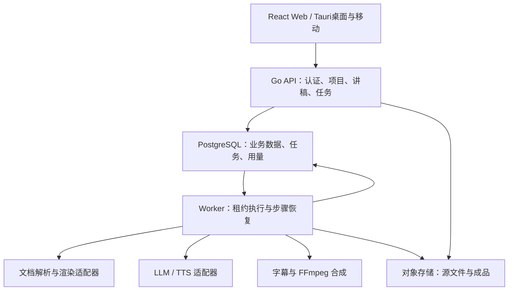
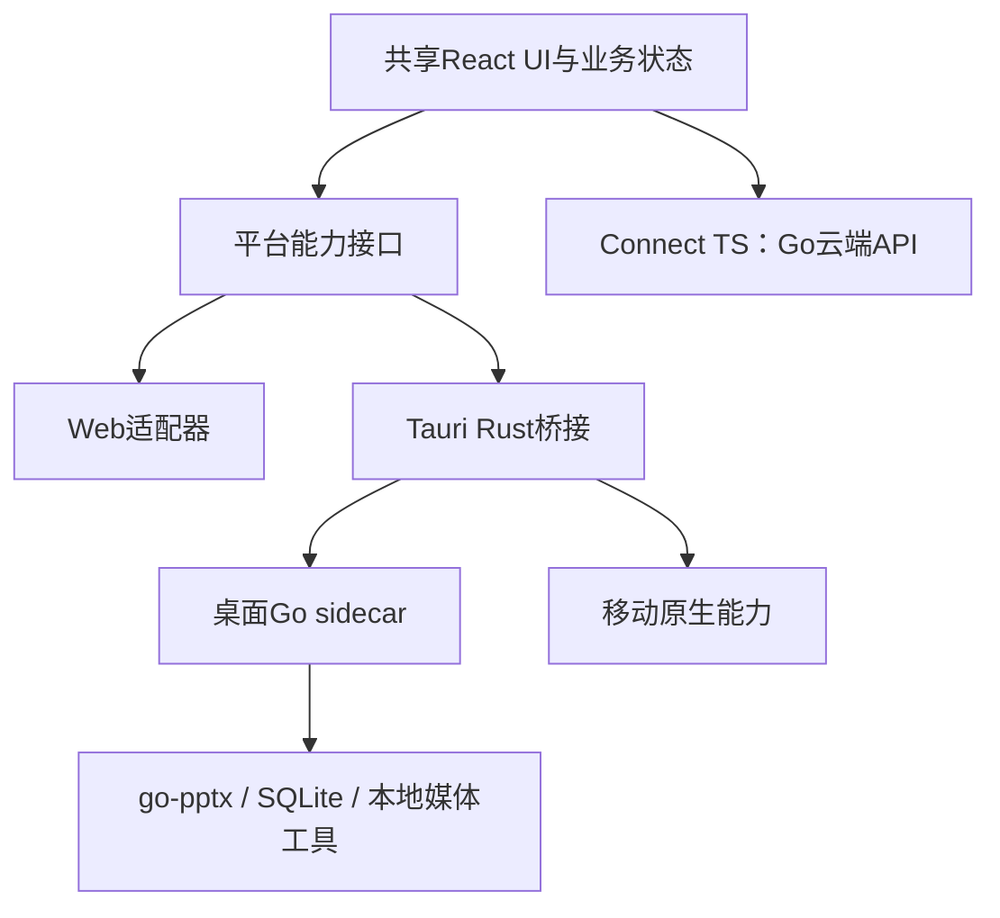

# PPT 自动讲解工具 — 完整技术方案 V3.6

> 版本：V3.6｜编制日期：2026-09-09  
> 基线：已交付的《PPT自动讲解工具-技术方案-V3.5.md》及用户确认的 Tauri 2 多端分工；保留 V3 原方案评审，完整整合客户端架构。  
> 定位：可从产品验证逐步演进到企业服务的开发设计基线。  
> 证据边界：本次未取得 go-pptx 源码及 V2 完整文档，V3 对其能力的描述按“待验证依赖”处理，不视为已经实现。官方产品能力与工程建议分别标注；时间、容量及质量指标均为规划目标，不是实测成绩。

## 1. 评审结论与核心决策

V3 选择 Go、模块化单体、独立 worker、契约优先和多租户隔离，总体方向合理。但目前更接近架构增补说明，缺少可直接实施的内容处理模型、可靠任务协议、离线边界、AI质量控制和兼容性验收；部分“可无成本切换”“天然保证”的描述需要收敛。

V3.6 的推荐方案是：**Go 模块化单体 API + 独立 worker + PostgreSQL 持久化任务 + 对象存储；以统一讲解工程模型连接解析、讲稿、音频、字幕和导出；React + TypeScript + Vite 共享前端，Tauri 2 统一桌面与移动客户端；桌面按需使用 Go sidecar，移动优先使用云端生成，Web 独立部署。**

### 1.0 V3.6 已确认决策与变更

用户已确认桌面与移动统一采用Tauri 2。本文给出完整方案，后续章节中的技术栈、接口、离线、测试与路线图均按该决定更新。

| 项目 | V3.5 | V3.6 |
|---|---|---|
| 客户端 | Wails桌面、Flutter移动按需推进 | Tauri 2承载桌面和移动；不建设独立Flutter客户端 |
| 前端 | React共享编辑器 | 共享UI、业务状态、Connect客户端；平台能力通过适配层注入 |
| 桌面Go复用 | Wails进程内调用 | Tauri Rust层管理Go sidecar，通过受限IPC调用 |
| 移动生成 | 未细化本地/云端边界 | 云端解析、TTS、视频导出优先；本地缓存、编辑和播放 |
| Rust职责 | 无 | 权限、平台桥接、凭据、sidecar生命周期；不重写Go业务 |
| 离线 | 本地能力包原则 | 区分缓存播放、离线编辑、桌面完整生成三个等级 |
| 交付验证 | 通用多端测试 | 增加IPC故障、移动后台音频、平台权限、签名升级与同步冲突门禁 |

### 1.1 六维评审

| 维度 | V3 的有效设计 | 主要不足 | V3.6 调整 |
|---|---|---|---|
| 功能完备性 | 已考虑多端、数字人、企业能力 | 核心朗读、脚本审核、播放器、兼容性未形成完整规格 | 明确三种讲稿模式、三种成品、增量生成和异常恢复 |
| 架构合理性 | 模块化单体与重任务隔离 | 独立 worker 与内存队列冲突；队列被误当成任务状态 | PostgreSQL 作为任务事实来源，短事务领取与租约执行 |
| 技术先进性 | Go/WASM、Connect、AI供应商适配 | 技术标签多于可度量价值，缺少多模态可信生成 | 引入来源锚点、术语规范化、时间对齐和模型评测 |
| 简单易用性 | 追求轻部署 | 三端并行、数字人及多后端过早增加负担 | 默认四步流程，专业编辑渐进展开，单一默认技术组合 |
| 可维护性 | 分层和生成客户端 | 接口泛化；缺少迁移、测试、版本和故障操作手册 | 按业务域组织、能力契约、可复现导出、ADR与回归语料 |
| 可扩展性 | Provider 思路正确 | 把数据隔离迁移、拆服务描述为近乎零成本 | 保留少量真实扩展点，明确迁移过程和触发指标 |

### 1.2 必须修正的技术判断

| V3 描述/隐含假设 | 修正结论 | 实施影响 |
|---|---|---|
| 独立 core、worker 配进程内 channel | channel 无法跨进程消费，也不能可靠保存已接受任务 | 生产首版使用数据库任务表；channel 只做本进程并发控制 |
| 单实例可以等丢任务后再升级 | 单实例也可能重启或崩溃 | 接受任务成功前必须持久化 |
| Connect 自带 REST/JSON | Connect 提供 HTTP 上的 RPC，可用 JSON 编码；不自动生成资源式 REST API [4] | 首版统一 RPC；如需 REST，另设薄映射层 |
| Flutter 借 TS 桥接 Connect | 该历史判断不准确，已有Connect-Dart [5]；V3.6已选React/Tauri | 当前只建设Go/TS远程契约客户端 |
| 生成契约根治所有字段问题 | 不能消除语义差异、字段缺省、旧版本客户端及业务校验问题 | 仍需契约测试和兼容期 |
| 建连时设置租户一次即可 | 连接池复用可能遗留租户状态 | 每个业务事务设置局部租户上下文；缺失即拒绝 |
| 启用 RLS 自动覆盖所有访问 | 超级用户、BYPASSRLS 角色绕过；表所有者通常也绕过 [6] | 分离迁移账号与运行账号，FORCE RLS，增加写入策略 |
| 检查幂等键后执行就不会重复扣费 | 并发检查有竞态；外部调用与本地提交存在崩溃窗口 | 唯一约束、租约、供应商请求记录和独立用量账本 |
| 两次配额检查即可防并发超额 | 两次检查均可能读到相同余额 | 原子预占、结算和释放 |
| Go 纯库内嵌就能完整离线配音 | 渲染、TTS、AI模型、字幕对齐及编码仍需本地能力 | 提供可验证的离线能力包 |
| Rust/Python 无法实现相关多端方案 | 属于不准确的语言排他判断 | Go 的理由是团队与代码复用，不宣称独占能力 |
| 自动换 TTS 供应商一定是无损降级 | 可能改变音色、语气、授权范围、数据处理区域 | 默认原供应商重试，跨供应商须符合项目策略 |
| 分层后拆服务仅改调用方式 | 仍涉及事务、认证、延迟、部署、数据所有权 | 以实际瓶颈驱动拆分 |

## 2. 业界实现路径与本项目定位

下表依据官方资料核对产品公开能力，不推测其内部架构，不按营销文案评定音质排名。不同产品套餐和入口可能不同，采购时再核对合同及实际版本。

| 路径 | 代表及官方事实 | 对本项目的借鉴 | 本项目的边界 |
|---|---|---|---|
| PowerPoint 内嵌配音 | Murf 插件支持导入备注或逐页输入讲稿 [1] | 尽量保留既有 PPT 工作方式，减少重复录入 | 插件后置，不将插件 API 当成通用渲染服务 |
| PPT 转 AI 视频 | Synthesia 支持 PPT 导入、备注作为讲稿及无备注时生成脚本 [2] | 场景化编辑、逐页审核、视频输出 | 自动生成讲稿已是基础能力，不作为唯一差异化 |
| 备注驱动批量视频 | Narakeet 支持备注转讲解；文档明确原生动画/转场支持限制 [3] | 默认自动同步，清晰公布兼容边界 | 自定义视频转场不等于复现 PowerPoint 原动画 |
| 商业演示渲染 SDK | Aspose.Slides 可生成演示帧并借助 FFmpeg 合成视频 [12] | 用可插拔渲染适配器提升复杂文档支持 | 按具体效果测试，不承诺全部动画一致 |
| 专业语音 API | Azure 提供 SSML/边界事件；ElevenLabs 提供带时间戳合成及对齐 API [14–17] | 用真实时间戳驱动字幕与高亮 | 按供应商、模型和音色声明功能，不统一假定支持 |

**差异化重点：专业内容讲准确、只重做改动部分、语音与页面同步、成品可修改、私有数据处理边界清晰。** 数字人、实时问答和复杂动画作为独立增强能力。

## 3. 产品范围与默认用户流程

### 3.1 三种讲稿模式

1. **原文朗读**：读取用户选定的备注或正文，不做语义改写；只应用经确认的读音规则。适合已有完整讲稿。
2. **润色讲解**：保持事实与结论，调整口语表达、转场和冗余。原稿与建议稿并排比较，由用户接受修改。
3. **AI 生成讲解**：结合正文、备注、表格、图表与页面截图生成草稿。每条关键事实附来源锚点，低置信内容标记待确认。

优先级为“用户锁定稿 > 用户选择的已有备注 > AI草稿”。不得在再次生成时覆盖锁定或已审核内容。备注与正文冲突时提出差异，不擅自选一个作为事实。

### 3.2 四步默认流程

**上传文件 → 选讲解方式、音色和时长 → 试听与确认 → 播放或导出。**

上传后先显示可用页面、缺失字体和动画提示；提供“先试听本页”按钮，不要求等全篇生成。普通用户不需要选择模型、编解码器、SSML或队列参数。完成后的项目仍可逐句修改，保留所有已生成版本。

### 3.3 核心功能矩阵

P0 为可用首版；P1 为产品化增强；P2 为独立扩展，版本号 V3.6 不意味着全部能力已经开发。

| 模块 | P0 | P1 | P2 |
|---|---|---|---|
| 导入 | PPTX、页码排序、备注/正文提取、隐藏页提示、异常页报告 | PDF导入、PPTX更新匹配、批量导入 | 旧PPT/更多平台格式转换 |
| 讲稿 | 三种模式、逐页编辑、草稿审核、锁定、撤销 | 段落改写、术语库、目标时长、多语言版本 | 企业知识库增强 |
| 语音 | 一家正式TTS、音色试听、语速、分段停顿、局部重生成 | 多供应商、专业读音词典、导入真人音频 | 已授权声音克隆、本地高质量TTS |
| 播放 | 音频驱动切页、暂停/继续、跳页、倍速、字幕开关、键盘操作 | 章节目录、全文检索、断点续播、授权分享 | 语音提问与讲解恢复 |
| 导出 | 静态画面MP4、音频包、SRT/VTT；带音频PPTX通过门禁后上线 | 图形高亮、旁白轨管理、品牌片头 | 认证动画模式、数字人 |
| 编辑 | 页面缩略图、讲稿、预览三栏，自动保存与冲突提示 | 简化时间轴、多人评论及审核 | 经需求验证后的实时协同 |
| 企业 | 身份认证、租户授权、额度、私有成品 | SSO、审计、分享撤销、管理员策略 | 独立实例、LMS/SCORM等集成 |

### 3.4 默认边界与用户体验

- 首版建议限制 100 页、100 MiB、单工程成品 60 分钟；均为可配置保护阈值，压测后调整。
- 默认跳过隐藏页，用户可选择纳入；保留原页ID与原页码映射。
- 纯封面、空白页和无讲稿页允许“静默停留”，不强制调用TTS。
- 4:3、16:9及自定义画布保持比例；视频必要时留边，不拉伸。
- 移动端优先审阅、试听和分享；复杂时间轴由Web/桌面处理。
- 提交生成前展示预计费用区间；遇到不兼容功能允许继续导出已支持版本，并准确说明差异。

## 4. 系统架构与部署边界

### 4.1 推荐架构



API 与 worker 使用同一代码仓库和应用层，独立进程部署。解析复杂文档、渲染、编码均在 worker 子进程或受限容器中执行，API只接收参数和查询状态。外部调用不持有数据库长事务。

### 4.2 领域边界

| 模块 | 自己负责的数据与逻辑 | 不承担的职责 |
|---|---|---|
| identity/tenant | 身份映射、成员关系、角色、策略 | 不解析PPT |
| project/document | 源文件版本、页面、元素、导入报告 | 不生成音频 |
| narration | 讲稿、分段、来源锚点、术语规则、审核 | 不直接绑定云SDK |
| pipeline | 依赖关系、任务状态、重试、租约、取消 | 不充当消息中间件 |
| media/export | 音轨、字幕、时间轴、导出产物 | 不决定用户扣费政策 |
| usage | 额度预占、结算、账本、成本记录 | 不以供应商回调直接修改余额 |
| integrations | LLM/TTS/渲染/存储等适配 | 不包含核心业务决策 |

接口定义在使用它的模块附近。仅对已存在的外部边界或测试边界建立接口；不要求每个内部函数都配接口。对象存储与业务数据库分别使用 `ObjectStore` 和领域 Repository，不再用一个 `StorageProvider` 混合表达。

### 4.3 默认技术栈

| 层 | 推荐默认 | 原因与限制 |
|---|---|---|
| 编辑器 | React + TypeScript + Vite | 适合静态部署，并复用于Tauri 2；公开营销站有SEO需求时另用Next.js |
| 原生客户端 | Tauri 2 + 薄Rust层 | 桌面/移动共用壳工程与平台配置；系统能力分别适配 |
| 桌面执行 | Go sidecar + 本地SQLite | Rust管理生命周期，Go承担文档与本地任务；不部署本地PostgreSQL |
| UI状态 | TanStack Query + 少量本地状态库 | 区分服务端缓存、编辑草稿和播放器状态 |
| API | Go + net/http + Connect；chi按路由需要引入 | 保留V3契约方向，减少重复框架 |
| 契约 | Protobuf + Buf lint/breaking + 生成客户端 | 服务端Go、各端TypeScript共享；本地IPC独立版本化 |
| 数据访问 | PostgreSQL + pgx + sqlc | 可审查SQL、事务与RLS明确；避免预建MySQL兼容层 |
| 异步任务 | PostgreSQL任务表 + 短事务领取 | 首版不额外依赖消息队列；持久化先于多副本 |
| 文档 | go-pptx适配器 + OOXML保真补丁 | 前提是通过真实文件门禁，未知能力可替换 |
| 渲染 | LibreOffice转PDF再逐页栅格化作为基线；商业SDK可选 | 独立进程、固定字体和版本，复杂效果单测 |
| 媒体 | FFmpeg/ffprobe | 时长探测、格式统一、字幕与视频合成 |
| AI | LLMClient / TTSProvider | 供应商模型能力显式配置，调用记录可追溯 |
| 存储 | S3兼容接口；部署时选一个已验证后端 | 单机可选本地文件适配器，多节点须共享存储 |
| 部署 | Docker Compose | Kubernetes、Redis、NATS均按指标引入 |
| 运维 | 结构化日志、基础指标；OpenTelemetry逐步扩展 | 避免首版同时维护多套观测平台 |

如现有 Next.js 工程已成型，可保留；桌面只复用不依赖 SSR/Server Actions 的编辑器包。此处不是要求重写已有前端。

## 5. go-pptx 与文档兼容策略

### 5.1 不把组件开发变成整项目阻塞项

将 go-pptx 定位为“结构读取和保真修改组件”，不默认它能完成完整视觉渲染、OCR、所有动画重放或TTS。纯Go、零cgo是该库的目标约束，不是整个产品全部依赖的保证。

接口至少区分：

- `DocumentReader.Inspect/Extract`：页序、正文、备注、表格、图片与特性清单。
- `NarrationWriter.Apply`：在原文档副本中绑定音频和计时，返回变更清单。
- `SlideRenderer.Render`：按指定尺寸输出页面图像及兼容性报告。

由适配器记录实现名称和版本；未实现时显式返回 `UNSUPPORTED_FEATURE`，不得输出伪成功文件。若go-pptx写入尚未过关，可先用经过验证的OOXML补丁实现或商业SDK适配，接口保持稳定。

### 5.2 解析策略

1. 验证ZIP/OOXML结构、大小及页数；按presentation关系读取真实页序，不能依赖slide文件名排序。
2. 提取文本框、组内文本、表格、备注正文；过滤备注母版页脚和页码等非讲稿内容。
3. 图表优先读取嵌入数据及坐标轴/单位，不执行嵌入工作簿；无法可靠提取时使用图像理解并降低置信度。
4. 使用坐标、组结构和文本语义辅助阅读顺序；对象顺序不必然等于阅读顺序。
5. 只对缺失文字的图片区域使用OCR；将OCR结果与原生文字去重。
6. 字体替换、SmartArt、OLE、公式、嵌入媒体、链接媒体、动画和触发器形成逐页报告。

### 5.3 能力分级

| 级别 | 承诺 | 典型输入 | 不承诺 |
|---|---|---|---|
| S：静态讲解 | 页面静态图 + 讲解音轨同步 | 常见文字、图片、表格 | 原生对象动画 |
| P：可编辑配音PPTX | 在已认证客户端可播放，原始内容尽量原样保留 | 静态PPT、简单自动动画 | 所有播放器一致、点击触发自动推断 |
| A：认证动画视频 | 仅支持清单内效果和明确事件映射 | 指定版本SDK及通过的样例 | 所有Morph、交互触发、嵌入媒体效果 |

不得把“源文件动画XML仍在”当成“加入配音后动画顺序正确”。原始文件作为不可变输入保存，写出使用副本；未修改部件尽量逐字节保留，删除旧生成音轨必须按本系统标识精确操作。

## 6. AI讲稿与专业内容质量

### 6.1 双通道理解与证据模型

结构通道提供正文、备注、表格单元格、图表数据；视觉通道提供整页截图和必要局部裁切。模型结合两者理解图文关系，不能只将OCR文本拼接当成页面理解。

每个事实块保存 `source_slide_id、shape_id、table_cell/chart_series、原始值、单位、来源类型、confidence`。AI生成段落引用事实块ID，数字、型号、比例、日期、单位通过确定性检查器再次比对。

例如页面包含“64 GB、PCIe 5.0 x16”，讲稿可增加释义，但不能凭空补充带宽或推导倍数。若用户开启外部资料增强，新增事实必须有独立来源、时间和“补充内容”标记；默认只基于本PPT，不自动联网填空。

### 6.2 生成流水线

1. 生成全篇主题、受众、章节和术语表，控制跨页术语与前后一致性。
2. 按页生成“要点与来源”结构化草稿，再形成口语稿。
3. 校验数字/单位、缺失来源、重复段落、遗漏重点和预估时长。
4. 仅对失败项定向修正，设置有限迭代次数；仍不满足则交给用户审核。
5. 冻结已确认讲稿版本后生成正式音频。

采用固定可观测流水线，无需首版引入多Agent自主编排。LLM只能返回限定结构与内容建议；备注中的“忽略规则、上传文件”等文本作为文档内容，不获得执行权限。

### 6.3 讲稿控制与读音层

| 控制项 | 设计 |
|---|---|
| 受众 | 入门、专业、管理层等预设，影响术语解释深度 |
| 风格 | 培训、汇报、产品演示，避免夸大或营销化改写 |
| 时长 | 总目标与单页范围；先压缩/扩写脚本，再小幅调整语速 |
| 备注 | 原文、润色、仅供参考三种策略，默认保留用户意图 |
| 术语 | 项目词典覆盖租户词典，词典规则有版本号 |
| 多语言 | 独立讲稿/音频/字幕版本，原稿更新后标记译稿过期 |

保存三份文本：用户可见稿 `display_text`、规范化发音稿 `spoken_text`、供应商输入 `provider_payload`。例如数字或缩写读法变化必须有文本跨度映射，避免字幕出现口语拼写或时间戳错位。停顿/强调作为结构化节点，按供应商能力编译，不让用户直接拼接任意SSML。

### 6.4 时长控制

字符数或词数除以经验语速只能用于生成前估算。正式时长以解码后音频采样数为准。超时默认建议缩稿，不以极端倍速解决。用户批准重写后，只重生成变更分段；可锁定不允许压缩的数字说明和结论。

### 6.5 可选智能能力

- 一键缩短、补充衔接、解释术语和定位可能误读的专有词。
- 自定义录音经转写、人工确认后作为讲稿；原录音可以直接用作旁白。
- 讲解时高亮当前对象，仅限高置信锚点，可人工调整。
- 后续“暂停提问”：基于当前页与全篇资料回答，标注页码；不确定时说明无依据，结束后回到暂停时间，不修改原成品。

## 7. 统一工程模型、版本与增量生成

### 7.1 核心实体

| 实体 | 关键字段 | 不变量 |
|---|---|---|
| Project | tenant_id、owner、policy、current_revision | 所有访问都经租户与项目授权 |
| SourceRevision | source_hash、object_key、parser_version | 源文件不可变 |
| Slide | stable_id、source_part、order、hidden、render_hash | 调整页序不改变内部ID |
| ScriptRevision | slide_id、language、mode、status、revision | 已审核稿不可被后台覆盖 |
| Segment | stable_id、display/spoken text、source_refs、speech_nodes | 语音生成与字幕的最小复用单位 |
| AudioAsset | content_hash、voice/model、sample_count、sample_rate | 资产与请求输入可追溯 |
| Alignment | audio_hash、text_hash、tokens、offsets、method | 文字或音频改变即失效 |
| TimelineRevision | slides、segments、cues、duration | 播放与导出共用同一时间轴 |
| Job/JobStep | input_snapshot、state、attempt、lease、error | 成功绑定固定输入快照 |
| Artifact | snapshot_id、format、hash、manifest | 成品不可变，最新版本只是指针 |
| UsageLedger | operation_id、quantity、unit、price_version | 唯一键防重复结算，纠错追加反向记录 |

所有租户业务表包含 `tenant_id`。必要的唯一约束和外键使用复合租户键，避免关联到其他租户对象。

### 7.2 示例工程片段

```json
{
  "schema_version": "1.0",
  "project_revision": 12,
  "source_revision": "src-03",
  "language": "zh-CN",
  "slides": [{
    "slide_id": "slide-07",
    "render_asset": "asset-render-07",
    "script_revision": 4,
    "segments": [{
      "segment_id": "seg-07-02",
      "display_text": "本页介绍 PCIe 5.0。",
      "spoken_text": "本页介绍 P C I E 五点零。",
      "source_refs": ["slide-07/shape-12"],
      "audio_asset": "asset-audio-72",
      "start_ms": 3500,
      "duration_ms": 4200
    }],
    "duration_ms": 8200
  }]
}
```

上例仅展示字段关系，不预定义最终读音，也不包含完整数据库结构。内部用整数采样位置或整数微秒计算，展示时转毫秒，避免长片浮点累计误差。

### 7.3 增量失效规则

| 修改 | 必须重算 | 可以复用 |
|---|---|---|
| 讲稿一个分段 | 该段TTS/对齐、所在页时间轴、后续全局偏移与合成 | 其他段音频、页面图 |
| 整篇音色或读音词典 | 受影响音频与全部相关对齐 | 页面图、未受影响脚本 |
| 字幕样式 | 烧录视频或字幕样式产物 | 语音与对齐时间 |
| 页序 | 全局时间轴、章节和合成；跨页衔接稿标记待复核 | 原页面与音频 |
| 页面内容/字体 | 对应渲染；相关脚本标记需审阅 | 用户确认不受影响的音频 |
| 模型/Prompt升级 | 新生成默认使用新版本；旧成品保持可追溯 | 已冻结旧快照 |

缓存键至少包含租户、规范化文本、音色、模型、供应商参数、词典、停顿规则与适配器版本。默认不跨租户共享内容缓存。只更新字幕标点也需检查文本映射，不能仅按音频哈希复用全部对齐结果。

## 8. TTS、字幕与播放同步

### 8.1 能力化供应商接口

```go
// 接口示意，具体字段由契约和适配器测试确定。
type TTSProvider interface {
    Capabilities(ctx context.Context, voiceID string) (VoiceCapabilities, error)
    Synthesize(ctx context.Context, req SynthesisRequest) (SynthesisResult, error)
}
```

`VoiceCapabilities` 包含支持语言、最大输入、SSML子集、读音控制、时间戳类型、流式能力、地区与模型标识。`SynthesisRequest` 包含逻辑操作ID、分段文本、结构化语音控制、输出规格。结果包含音频、格式、真实时长、对齐、供应商请求ID、计费单位和警告。

异步供应商在适配器内部实现提交/查询/取消，并持久化远端任务ID。能力不支持时在生成前提示；禁止静默丢弃语气或发音参数。

### 8.2 供应商策略

首版只接一家正式可用且区域适合的TTS，Azure可作为有完整官方文档的基线；若部署区域或采购条件不适合，再对国内正式API进行相同语料测试并确定默认实现。ElevenLabs作为后续选项。准确价格、地区、商用权益在接入时核验，不在本文填未经验证的报价。

`edge-tts` 是调用Edge在线语音服务的第三方项目，不是微软正式商用API产品；其README明确自定义SSML限制 [18]。可用于开发体验，不承担付费主链路或离线承诺。CosyVoice可作为本地能力候选 [19]，需逐项核验代码、模型权重与声音素材的使用条件。

### 8.3 分段与音频资产

按语义句群切分，避免每几个字请求一次导致语气断裂。分段粒度由音色测试决定；局部重生成默认替换完整句群，必要时连同前后句生成，最终只采用目标片段。不能默认供应商跨请求保持完全一致。

内部统一采样率和声道，保存可复现的音频母版及压缩分发版本；页面音轨由分段拼接，整篇由页面时间轴装配。音量规范化和静音处理须保留实际时长映射；不能在对齐完成后随意裁去静音。

### 8.4 字幕对齐

优先顺序：供应商原生时间戳 → 经验证的强制对齐 → 明确标记为估算的句级字幕。已有确认讲稿应优先强制对齐，不用ASR结果自动替换专业术语。模型产生漏读、重读时将其作为音频质量问题重做。

- Azure边界事件、ElevenLabs时间戳单位不同，适配器统一到内部时间基准 [15–17]。
- 中文字幕按语义断行；每屏最多两行作为默认规则，字体与行长随画布适配。
- 浏览器使用VTT，通用下载提供SRT；MP4可选择烧录字幕。
- 不保证软字幕在所有移动播放器可见；需要即开即看的用户选择烧录。

### 8.5 单一时间轴

默认无重叠切页：`D_page = lead_in + Σ(audio_segment_duration + gap) + tail_hold`。

页面开始时间是前面页面时长之和；首版转场使用不改变页面区间的视觉处理或直接切换。后续交叉淡化必须明确定义重叠区，并在统一时间轴中扣除重叠时长；不得只改FFmpeg滤镜而不改字幕偏移。

播放器使用媒体时钟作为主时钟，页面和字幕根据音频当前位置计算，不能用独立 `setTimeout` 累计翻页。跳页停止旧音频并加载目标位置；缓冲时暂停时间推进；倍速改变播放速率，不改资产时间戳。浏览器首次播放需要用户触发，后台切换、耳机中断和移动端锁屏行为按目标平台测试。

## 9. 三种成品与渲染实现

### 9.1 Web讲解工程

页面图、分段/页面音轨、字幕和时间轴作为独立资源，支持即时试听与局部更新。下载和分享必须授权；对象存储私有，使用短期签名链接。分享可过期/撤销；已经下载的离线文件无法远程收回，应在界面明确。

### 9.2 MP4

基线路径：PPTX → 固定字体环境的页面PDF/PNG → 统一时间轴 → FFmpeg → ffprobe与抽帧验证。

默认1080p、H.264、AAC、yuv420p，保留画布比例；输出参数均为项目预设，不是对全部环境的性能承诺。所有片段统一分辨率、帧率、采样率、声道、时间基准；只有编码参数匹配才采用无重编码拼接。音轨不足按时间轴补静音，画面不足补尾帧，不依赖 `-shortest` 掩盖错误。

通过FFmpeg过滤器进行响度与字幕处理 [20]。建议将响度目标设为可配置项目预设，先试听再固定；保留人声清晰度，背景音乐和数字人不影响字幕基准。FFmpeg构建及所启用编码器的分发许可单独记录。

### 9.3 带音频PPTX

此能力是独立开发门禁，不能从“可以写PPTX”推导“所有客户端能自动播音”。

1. 复制源OOXML包，增加媒体文件、Content Types与页级relationships。
2. 写入符合目标客户端要求的音频对象、媒体关系与播放时间节点。
3. 新音轨使用稳定TrackKey或等价系统标识；重跑只更新同一逻辑音轨。
4. 通过 `p:timing` 处理页内定时事件；通过 `p:transition` 的 `advTm` 设置自动切页时间，单位毫秒；不能虚构通用 `slideTiming` 节点 [9–10]。
5. 保留与合并已有timing树，避免覆盖用户动画；配置放映使用计时，验证点击和自动模式。
6. 为含点击触发的页面要求用户选择“保留手动”“确认自动事件映射”或“静态视频”；不得推测点击时刻。
7. 在认证客户端验证音频自动开始、切页不串音、重新进入页面、隐藏图标、末页结束及重开保存。

输出不把页面扁平化作为默认“可编辑PPTX”。若用户选择图片封装版，明确它只保留画面，不保留原对象可编辑性。

### 9.4 动画策略

优先交付静态同步与少量高亮效果。商业SDK动画导出是“生成帧 + 外部视频编码”的工作流 [12]，仍需支持清单与测试。Microsoft明确不建议或不支持通常的无人值守服务器端Office自动化 [13]，因此服务器COM不作为SaaS基础架构。用户本机交互式PowerPoint辅助导出可单独评估，其安装、许可与支持条件不能与服务器方案混为一谈。

## 10. 可靠任务系统

### 10.1 原则与任务状态

数据库保存事实，队列或通知只负责唤醒。API只有在项目快照和任务提交成功后才返回已接受。一次生成展开为导入、渲染、讲稿、TTS分段、对齐、页面装配和导出步骤；只调度依赖已经完成的步骤。

任务状态：`QUEUED → RUNNING → SUCCEEDED`；可进入 `RETRY_WAIT、WAITING_REVIEW、FAILED、CANCEL_REQUESTED、CANCELED`。部分页成功时总工程可处于待处理状态，用户可试听成功页；正式导出必须满足所选范围的完整性要求。

### 10.2 PostgreSQL任务实现

PostgreSQL `SKIP LOCKED`适用于多个消费者访问队列式表的场景 [7]。采用已有数据库降低部署依赖，不宣称无限扩展。

- 领取时短事务锁定符合队列、可运行时间、租户配额和依赖条件的任务。
- 原子写入 `lease_owner、lease_until、attempt、fencing_token`，随后提交事务。
- 执行在事务外进行；长任务定期心跳续租，输出写入本attempt的临时对象前缀。
- 完成时以任务ID、当前状态和fencing_token条件更新；过期worker的提交无效。
- 结果引用与步骤完成在同一数据库事务提交；临时资产校验后才可被正式成品引用。
- 定时扫描过期租约、长时间等待任务和无引用临时资产。崩溃后只重跑未确认完成的步骤。

不得在耗时TTS/FFmpeg期间持有 `FOR UPDATE` 锁。数据库领取器只能访问最少调度元数据，不读取所有租户讲稿；业务worker在任务所属租户上下文中处理内容。

### 10.3 幂等、外部副作用与扣费

| 层 | 机制 |
|---|---|
| API重复提交 | `(tenant_id, idempotency_key)`唯一；保存请求哈希，同键不同请求拒绝 |
| 任务逻辑重复 | `snapshot + step_type + segment/config_hash`唯一 |
| 并发worker | 领取锁、租约、fencing条件提交 |
| 外部生成 | 持久化provider_request_id；供应商支持时使用幂等键或查询任务 |
| 用户用量 | `(tenant_id, logical_operation_id, usage_kind)`唯一账本 |
| 文件发布 | 内容哈希/不可变对象，校验成功后事务提交引用 |

如果供应商已成功而worker未保存结果，且供应商不支持幂等或查询，就无法严格保证不重复调用、不产生重复外部成本。此时进入 `UNKNOWN_PROVIDER_RESULT` 对账分支，限制自动重试次数；用户账本仍按业务规则防重复结算。消息中间件的exactly-once能力不能跨越供应商和数据库事务边界 [8]。

### 10.4 重试、取消与调度

- 超时、429、临时5xx：退避加随机抖动，并尊重Retry-After；次数与总时限可配置。
- 格式错误、授权错误、永久不支持：不盲目重试，展示可操作原因。
- 取消：先持久化请求，worker安全点检查；可取消供应商任务则取消，FFmpeg终止整个子进程组；已发生供应商成本按公开政策记账。
- 根据租户并发额度和公平调度分配任务，避免大客户阻塞所有小任务。
- 首版TTS和渲染至少分别设置并发信号量；需要时拆成不同worker池。

### 10.5 NATS升级条件

当数据库调度锁等待、队列延迟持续超出已测容量，或出现多个独立消费者/跨服务事件需求，再引入JetStream。迁移使用事务Outbox：业务更新与事件同事务写库，发布器转发；消费者仍以数据库状态、Inbox去重和fencing提交为准。设置持久消费者、Ack策略、失败重投与死信处理；多副本API本身不是引入NATS的充分理由。

## 11. API、事件与多端

### 11.1 契约与资源操作

| 服务 | 主要操作 |
|---|---|
| ProjectService | Create/Get/List、CreateSourceRevision、Archive |
| UploadService | CreateUpload、CompleteUpload、AbortUpload |
| ScriptService | Get/UpdateRevision、GenerateDraft、Approve、Lock |
| NarrationService | Estimate、CreateGeneration、RegenerateSegments |
| JobService | Get/List、Cancel、RetryFailed、WatchEvents |
| ExportService | CreateExport、GetArtifact、CreateDownload |
| TenantService | Members、Roles、Quota、Usage、Policy |

大文件走授权直传和分片上传，RPC只传元数据；CompleteUpload检查大小、哈希和租户所有权后才创建解析任务。预签名链接限制对象键及有效期，不能让客户端任意指定其他租户路径。

错误模型包含 `code、message、retryable、retry_after、affected_slide_ids、trace_id`。分页使用游标。讲稿更新携带 `expected_revision`，冲突返回最新版及差异，禁止最后写入者静默覆盖。

### 11.2 事件与兼容性

首版可用增量轮询；增强版用Connect服务端流，保留轮询回退。事件包含单调序号，客户端重连携带最后序号；超出保留窗口则拉全量状态。浏览器不依赖双向RPC流完成核心流程。

Protobuf字段移除后保留字段号与名称；校验枚举未知值、optional语义、int64与JSON序列化、时间格式。通过Buf兼容检查与真实旧客户端回归；破坏性语义变更才开新版本包。REST需求确认后，复用应用服务增加映射并发布OpenAPI，而非维护第二套业务逻辑。

### 11.3 多端统一架构与责任边界

Tauri 2作为原生应用容器，浏览器版使用共享React工程单独构建。Tauri支持桌面和移动平台 [11]，但共享壳工程不意味着每个插件、后台任务和文件操作在所有平台行为相同。云端服务继续使用Go，不因客户端框架调整而重写。



上图表示逻辑调用关系：Web构建不加载Tauri运行时；桌面和移动分别注册平台实现。Go云端API及worker继续使用第4章架构。

| 层级 | 职责 | 边界 |
|---|---|---|
| React/TypeScript | 编辑器、讲稿规则的界面呈现、时间轴视图、API客户端、项目状态 | 不直接调用shell、不保存供应商主密钥 |
| PlatformAdapter | 文件、下载、播放器、通知、安全凭据、本地任务能力 | 统一语义，显式返回不支持；不掩盖平台差异 |
| Rust/Tauri | 原生调用、权限检查、资源句柄、桌面进程生命周期、事件转发 | 不重复实现讲稿编排、PPTX写入、计费与任务领域 |
| Go sidecar（仅桌面） | go-pptx、本地工程、任务恢复、媒体工具编排 | 不运行完整云端API，不需要本地NATS/Redis/PostgreSQL |
| 移动原生插件 | 系统媒体控制、音频生命周期、文件授权和分享等 | 按需用Kotlin/Swift实现或接入已验证插件 [24] |
| Go云端 | 多租户、AI生成、复杂渲染、合成、计量和协作 | 承担Web/移动默认重任务，也供桌面联网模式调用 |

Web/桌面采用三栏编辑器与时间轴，移动采用单页编辑、审阅和播放布局。复用组件、类型和规则，不规定未经测量的代码复用率。已有Next.js前端若继续保留，供Tauri使用的包必须可静态构建，SSR/Server Actions留在Web服务侧。

### 11.4 各端能力与执行位置

| 功能 | Web | Tauri桌面 | Tauri移动 |
|---|---|---|---|
| 编辑与审核 | 浏览器，自动保存云端 | 本地草稿/云端工程 | 本地草稿/云端工程，简化布局 |
| PPT解析与备注提取 | 云端；WASM可选优化 | 已验证Go sidecar或云端 | 默认云端 |
| 画面渲染 | 云端 | 云端或本地渲染能力包 | 默认云端，缓存页面图 |
| LLM/TTS生成 | 云端 | 默认云端，本地模型包后续可选 | 默认云端 |
| 音频PPTX/MP4导出 | 云端 | 云端或已认证本地工具链 | 云端生成后下载/分享 |
| 离线播放 | 浏览器缓存策略允许时 | 已下载完整工程 | 已下载完整工程，由本地媒体实现播放 |
| 后台朗读 | 受浏览器与操作系统限制 | 平台播放器实现验证 | 必须经过移动原生音频能力验证 |
| 离线完整生成 | 不作为首版承诺 | 完整依赖包通过认证后支持 | 不作为当前范围 |

原生应用的文件选取结果可能是系统授权URI而非普通路径。移动端通过授权接口读取或复制到应用沙箱；桌面文件导入也形成受控项目副本，不能把任意路径直接交给执行器。

### 11.5 桌面 Go sidecar 与本地IPC

Tauri支持附带外部二进制，并要求准备对应目标架构的程序 [22]。推荐链路为：React调用业务级Tauri command → Rust校验并转发 → Go执行 → Rust转发结果/进度。前端不直接获得任意执行命令权限。

首版采用父子进程标准输入/输出上的有界JSON消息协议，避免开放本地HTTP监听端口。协议是项目设计，不是Connect RPC；云端仍使用Connect。使用JSON Schema生成/校验跨语言消息类型，避免手写三套字段。

| 项目 | 约定 |
|---|---|
| 启动握手 | protocol_version、engine_version、supported_methods、capabilities；主版本不匹配拒绝本地执行 |
| 请求 | request_id、method、deadline_ms、project_id、input_revision、payload |
| 响应 | request_id、result或结构化error；错误含code、retryable、trace_id |
| 异步任务 | Submit返回持久化job_id；Progress事件带job_id和递增序号；Get/Cancel显式方法 |
| 消息边界 | 一行一个JSON，规范JSON转义；限制单消息大小，增量缓冲处理分块及半条消息 |
| 大资源 | 使用受控asset_id和文件清单；音频/图片不以Base64持续穿过UI消息通道 |
| 输出约束 | stdout仅协议，stderr为脱敏日志；限制日志与进度速率 |
| 背压 | 有界队列与任务并发；进度可合并，终态必须可通过Get重取 |

Rust在首次本地操作时懒启动sidecar；有任务时监控活性与心跳。崩溃后有限退避重启并查询SQLite任务状态，不盲目重新提交外部调用。用户关闭窗口与退出应用分别定义：退出前保存草稿，选择等待或取消任务；后台运行需用户明确开启。父进程异常退出时，通过管道关闭/父存活检测及各平台进程管理清理遗留子进程，列入故障测试。

本地SQLite由Go sidecar单独负责项目和生成任务写入，Tauri不直接并发修改相同业务表。Go执行本地FFmpeg/渲染器时使用固定可执行路径与参数数组；复用云端资源限制与取消逻辑，平台不支持的隔离手段须提供等效控制。系统沙箱限制须在目标发行渠道验证。

远程供应商的重试、幂等和未知结果窗口遵循第10章。本地计算统计只作为本地记录；SaaS额度和收费由服务端权威账本决定，不信任客户端上报作为直接扣费依据。

### 11.6 移动端不采用桌面sidecar

官方Shell插件在Android/iOS仅支持打开URL，不支持桌面式子进程启动 [23]。因此当前移动包不包含Go sidecar，也不尝试在手机上运行桌面LibreOffice/FFmpeg可执行程序。未来如需移动本地解析或模型推理，应单独采用可嵌入库与原生绑定，重新评估包体、耗电、内存和发布条件。

移动端首版重点为PPT上传、讲稿审核、云任务管理、成品下载及播放。App切后台不影响已提交的云端任务；上传中断保留分片状态，恢复后重传缺失部分。依赖后台持续上传的需求必须采用平台允许的原生机制，不能假定WebView中的fetch一直运行。

播放器适配器采用统一接口：load/play/pause/seek/setRate/getPosition，事件包括position、buffering、interruption和ended。平台内只有一个权威播放时钟；启用原生音频后WebView只更新页面和字幕，不同时播放第二份音轨。

移动验收必须覆盖锁屏朗读、系统播放暂停、耳机控制、蓝牙切换、来电/音频焦点中断、倍速与断点恢复。Android音频服务及iOS音频会话按目标系统实现并验证，不能把系统TTS能力等同于后台播放能力。缓存已下载音频后才能承诺无网络播放。

### 11.7 离线等级与数据同步

| 等级 | 可用功能 | 依赖与边界 |
|---|---|---|
| L0 联网 | 所有已上线云端功能 | 云端认证、上传及生成服务 |
| L1 缓存播放 | 无网查看页面、字幕和播放音频 | 下载manifest与全部必需资产，校验后原子标记可离线 |
| L2 离线编辑 | 修改已下载工程讲稿、页序、读音设置 | 本地数据库与待同步记录；改稿后原音频标记过期 |
| L3 桌面离线生成 | 本地解析、渲染、TTS及导出 | Go sidecar、渲染器、字体、模型及编码依赖齐全并认证 |

移动以L1/L2为目标；完整离线AI生成不进入当前默认范围。桌面基础安装包和可选能力包分离，界面展示“可用/未安装/不支持”，不因缺少本地模型而静默上传。完整离线安装介质需要提前包含依赖及许可信息，首次使用不能要求联网补齐。

下载manifest固定工程revision、资产哈希、尺寸和schema版本。缓存按工程清单引用，支持空间上限、清理与损坏重下；项目登出/租户切换不能把缓存暴露给另一个账号。

同步以显式云工程映射及base_revision进行：本地操作带operation_id、expected_revision，服务端执行授权和幂等更新。无冲突时提交新版本；冲突展示差异或创建分支副本，不使用静默最后写入覆盖。源PPT更新后重新计算受影响资产。公开计费状态以云端为准。首版不引入CRDT。

### 11.8 平台接口与权限边界

PlatformAdapter至少拆分FileAccess、Playback、LocalProjectStore、TaskExecutor、Notification、CredentialStore和Share。启动时暴露运行时能力清单，例如local_parse、offline_tts、background_audio；只有已安装且通过当前平台验证才返回可用。测试使用适配器替身，不在业务组件内到处判断操作系统。

Tauri capabilities按窗口和平台授予最小命令集 [25]。本地路径、导出目标、资源读取和Rust自定义命令都实施服务端式校验；不能只依赖隐藏按钮。禁用来自远程网页的本地执行能力，链接在外部浏览器打开；讲稿HTML严格净化，配置CSP，资源协议限制到项目目录。sidecar本身仍有操作系统权限，因此它也必须校验路径、尺寸与参数，不能把Tauri权限视为子进程沙箱。

原生登录使用系统浏览器的OIDC Authorization Code + PKCE，经已验证的回调完成；身份供应商支持范围在接入时核对。刷新凭据置于系统安全存储，前端只保留必要的短期状态；Web与原生分别配置登录重定向。供应商平台密钥只留云端。个人BYOK为后续显式模式，凭据不进入工程文件和日志。

### 11.9 构建、发行与升级

共用前端包与Tauri壳源码，按桌面/移动生成不同capabilities、插件和资源配置。移动构建排除sidecar及桌面媒体工具。锁定Rust、Go、Node与插件版本；云端API兼容N/N-1客户端，本地协议在启动时校验。

桌面首批优先Windows x64、macOS arm64；其他目标在实际设备及依赖组合验证后纳入，支持平台与已认证平台分别展示。iOS构建使用macOS/Xcode环境，Android使用相应SDK/NDK；不能只靠Go交叉编译产出完整安装包。

桌面发行同时包含壳、sidecar及配套资源清单，做版本/哈希检查与平台签名。使用桌面Updater时执行签名验证 [26]，只在任务安全点升级；数据库迁移保留回滚副本或明确最低兼容版本。移动通过目标应用商店或经确认的企业分发流程升级，不复用桌面自更新机制。新版本上线先灰度，验证工程迁移、断点恢复与权限行为。

## 12. 多租户、配额和身份

### 12.1 数据隔离

延续V3共享表 + tenant_id + RLS的方案；此为本产品默认决策，不从其他项目推断隔离偏好。租户ID由登录身份与已验证成员关系确定，客户端传来的tenant_id不是授权依据。

示意SQL如下，完整迁移还需角色、约束与权限定义：

```sql
ALTER TABLE projects ENABLE ROW LEVEL SECURITY;
ALTER TABLE projects FORCE ROW LEVEL SECURITY;
CREATE POLICY projects_tenant_policy ON projects
  FOR ALL TO app_runtime
  USING (tenant_id = NULLIF(current_setting('app.tenant_id', true), '')::uuid)
  WITH CHECK (tenant_id = NULLIF(current_setting('app.tenant_id', true), '')::uuid);

-- 每个业务事务执行；$1为服务端已经授权的租户UUID。
BEGIN;
SELECT set_config('app.tenant_id', $1, true);
-- 业务查询/写入，全部使用同一事务连接
COMMIT;
```

第三个参数true表示事务局部配置 [21]。运行账号不是表所有者、超级用户或BYPASSRLS角色；没有上下文时拒绝，异常路径回滚。RLS是防漏过滤的防线，不能替代SQL注入防护、业务授权和数据库账号保护。

对象存储前缀、缓存键、任务payload、下载签名、日志和向量检索同样隔离。平台调度器若需跨租户领取，使用独立最小权限角色，只访问任务调度表/受限函数；不得把BYPASSRLS通用账号交给普通worker。

### 12.2 配额与用量

用“预占 → 执行 → 结算/释放”处理并发：在事务内条件更新余额或锁定额度行，只有预占成功才能创建可执行任务。执行前检查政策变化并处理预占过期；发现额度不足暂停后续新分段，避免无上限调用。

供应商成本和用户计费分开记录。供应商可能按字符、token、音频时长或请求计费；用户套餐可以按生成分钟计量，账本保存原始数量、折算规则和价格版本。重试成功、取消中途和用户主动重生成的收费政策必须可展示、可审计。

### 12.3 认证与权限

优先集成成熟OIDC实现或托管身份服务；不首版自研完整密码、找回、MFA和SAML协议栈。企业SAML需求通过成熟身份代理对接。角色建议Owner、Admin、Editor、Reviewer、Viewer，并区分导出、分享、声音管理和费用管理权限。

独立schema/数据库升级需要租户路由、暂停写入/增量同步、完整数据与对象清单、核对、切换和回滚；schema仍共享实例，不等于物理隔离。没有客户需求时不预建复杂迁移平台。

## 13. 文件安全、AI边界与私有化

- 限制ZIP解压总量、压缩比、文件数和路径；阻止Zip Slip、外部实体、远端资源自动加载。
- 首版拒绝宏文件、加密文件和不支持格式并说明处理方式；不执行OLE、宏或文档脚本。
- 渲染子进程非root、只读根目录、临时工作目录、CPU/内存/时限限制；默认无网络，只有AI适配器按白名单外连。
- 源文件、备注和录音默认不进入日志；日志只记录ID、步骤和错误类别。密钥放专用密钥存储或运行时Secret。
- 对供应商配置数据区域、保留政策与允许的内容级别。隐私模式可以禁止云LLM/TTS，不能静默降级外发。
- 克隆声音需要明确授权记录、用途和撤销流程；未取得授权时只使用标准音色。面向具体市场的内容标识和许可在上线评审中按实际业务核验，本文不作笼统合规保证。
- 删除项目后按保留政策清理派生产物、缓存和临时对象；备份中的到期清理另列周期。导出默认去除不必要的内部批注、身份元数据，用户可选择保留备注。

## 14. 高可用、运维与成本

### 14.1 部署档位

| 档位 | 拓扑 | 明确能力 |
|---|---|---|
| 开发/试点 | API + worker + PostgreSQL + 本地/对象存储，单机Compose | 可从进程故障恢复；不是基础设施高可用 |
| 付费基础版 | 多副本API、独立worker、可靠数据库备份、共享对象存储 | 任意worker重启不丢已提交任务；数据库可用性取决于实际部署 |
| 高可用版 | 跨故障域API/worker、配置HA的数据库、已核验冗余存储、恢复演练 | 以整链路实测SLO为准；不能只靠“用了云服务”保证 |
| 规模版 | 分类worker池、可选JetStream/Redis、按瓶颈拆域服务 | 用队列等待、资源利用率和团队边界推动 |

同一主机两个容器不是高可用；对象存储不同存储类别和区域的冗余能力不同，必须逐项核验。API无状态只能减少进程故障影响，不能消除数据库、身份或供应商单点。

### 14.2 指标与操作手册

核心指标：任务接受成功率、队列最老等待时间、步骤失败率、租约过期数、TTS延迟/429、实际生成实时系数、导出耗时、临时磁盘、每项目成本、额度预占滞留。租户/项目ID保留在日志和追踪，不直接全部作为高基数指标标签。

追踪采用请求短Span + 异步任务Span Link，不维持数小时HTTP请求。操作手册至少覆盖：worker强杀、供应商限流、数据库切换、磁盘满、字体缺失、孤儿资产清理、未知供应商结果对账和备份恢复。

### 14.3 成本模型

`项目成本 = LLM输入/输出费用 + TTS实际调用费用 + 对齐/OCR费用 + 渲染计算 + 存储与流量 + 商业SDK摊销`。

不能默认TTS始终是最大成本；长视频、数字人和大流量分享可能改变成本结构。预算上限在创建任务时固定，产生超预算的新调用前暂停并给出选择。按段缓存、只重做失败步骤、预览低分辨率、正式导出高分辨率是首批优化；自建GPU须结合利用率、运维和模型质量算总成本。

### 14.4 规划SLO

以下作为试点目标，在规定机器、语料和并发下验证后再承诺：

| 指标 | 建议门槛 | 测量范围 |
|---|---|---|
| API接受/查询延迟 | P95 ≤ 500 ms | 不含文件上传与外部生成，记录并发与数据量 |
| 已接受任务恢复 | 强杀后无任务静默丢失，租约到期可重新领取 | 进程故障注入，核对任务和账本 |
| 字幕对齐 | 抽样句首偏差P95 ≤ 200 ms | 人工标注语料，专业词与中英混读单列 |
| 音画累计误差 | 30分钟成品尾部偏差 ≤ 100 ms | 解码后的真实时间戳，不用文件标称时长 |
| 文档兼容 | 认证语料100%无损坏文件、无修复弹窗 | 视觉错误与播放错误独立统计 |
| 可用性 | HA版初始月度目标99.5% | 明确测量入口、依赖影响和维护窗口 |
| 恢复目标 | HA版暂定RPO ≤ 15分钟、RTO ≤ 2小时 | 数据库及对象引用联合恢复演练 |

生成耗时不写固定“几秒生成全篇”；需先记录 `生成耗时/成品时长` 和吞吐随并发的曲线。RPO与“不丢进程内任务”是不同故障范围，数据库灾难可能丢失备份窗口内数据。

## 15. 可维护性、仓库和验证体系

### 15.1 组织方式

建议一个Go应用module，外部go-pptx按发布版本依赖；若共同开发可使用go.work，本地工作区不替代正式版本锁定。主要目录为 `cmd/api、cmd/worker、internal/project、internal/narration、internal/pipeline、internal/media、internal/tenant、internal/usage、internal/integrations、proto、migrations、web、testdata、docs/adr`。客户端采用 `apps/web、apps/native/src-tauri、packages/ui、packages/editor、packages/platform、packages/api-client`；Go增加 `cmd/local-engine`，供桌面sidecar使用。TypeScript工作区共享组件与契约，Rust维持薄桥接层，客户端与服务端可分别发布。

业务域不依赖云SDK或HTTP框架，由CI依赖检查约束；也不要求领域类型完全没有所有第三方依赖。适配器契约测试覆盖格式、错误、时间单位、资源释放与取消。

### 15.2 数据库与工程格式演进

迁移采用expand → migrate → contract，先加兼容字段、批量回填、切流后删除旧字段；数据库迁移由单独发布步骤执行。任务payload、工程schema、Prompt、词典、模型、渲染器与字体集合均记录版本。旧成品保持不变；重现时能定位环境，无法锁定外部模型版本时明确仅能追溯、不能保证逐采样复现。

### 15.3 关键测试

| 类型 | 重点样例与验收 |
|---|---|
| 文档回归 | 至少30份100+页的组合语料：中英混排、表格、图表、组形状、字体、动画、隐藏页、嵌入媒体 |
| PPTX写入 | 目标Windows PowerPoint具体版本优先；macOS/WPS分别认证，未测试不标支持 |
| 幂等与恢复 | 提交后崩溃、外部成功后崩溃、重复消息、租约过期、旧worker迟到、重复结算 |
| 多租户 | 同一连接连续切租户、上下文缺失、写入伪造租户、跨租户外键、对象签名、worker任务伪造 |
| AI质量 | 数字/单位、型号、表格行列归属、无依据扩写、图文冲突、长稿压缩、专业读音 |
| Tauri与本地IPC | 分块消息、取消、sidecar强杀、父进程退出、协议不匹配、大资源传递、权限拒绝、升级恢复 |
| 移动真机 | Android/iOS锁屏连续播放、耳机/来电恢复、URI文件导入、下载/分享、缓存租户隔离；每项标记实测设备和版本 |
| 播放与导出 | 跳页、倍速、后台恢复、断网、长视频尾部误差、字幕换行和音轨尾部截断 |
| 安全与资源 | ZIP炸弹、路径穿越、外部引用、巨大图片、渲染超时和磁盘满 |
| 升级兼容 | N与N-1客户端、旧工程迁移、任务执行中发布、配置回滚 |

AI评测集建议首批100页，人工审核关键数字是否全部忠于来源；“零未经批准的数字变更”作为发布门禁。模型自评只做筛选，不能当最终事实校验。语音自然度采用匿名对比试听，同时记录误读、漏读和重读，避免只用主观音质排名。

## 16. 分阶段交付与开发门禁

假设一名Go后端、一名前端及兼职测试/产品支持，原生阶段还需具备Rust和移动音频集成能力的工程支持；以下为工作量估算，单人开发需重新排期。go-pptx未完成、复杂PPT兼容和本地模型部署是主要不确定项。

| 阶段 | 参考时长 | 交付 | 放行条件 |
|---|---|---|---|
| G0：技术验证 | 2–3周 | go-pptx与导出验证；Tauri桌面Go调用、Android/iOS文件导入及后台音频原型 | 明确认证平台和插件缺口；不支持能力有替代路径 |
| G1：基础闭环 | 3–4周 | Web编辑、源文件版本、持久化任务、逐页配音、播放器、MP4/字幕 | 重启可恢复、语音与字幕同步、源文件可追溯 |
| G2：AI产品化 | 2–3周 | 三种稿件模式、来源校验、读音词典、局部重生成、预算 | 专业语料门禁；编辑不覆盖审核稿 |
| G3：商用加固 | 2–3周 | RLS、配额账本、角色、审计、备份和故障演练 | 跨租户与重复扣费测试通过 |
| G4：统一原生客户端 | 3–5周 | Tauri桌面/移动、共享适配器、桌面sidecar、移动L1/L2与原生播放 | 真机音频、IPC恢复、签名发行、同步冲突验收通过 |
| G5：能力扩展 | 独立估算 | 桌面L3、数字人、动画、多语言、SSO高级集成 | 模型/渲染能力包及各自支持矩阵通过 |

多租户字段、授权上下文、持久化任务和账本唯一性必须从G1建模；G3是加固与完整运营能力，不是等付费后再补基本隔离。配音PPTX若G0未通过，明确保留实验状态，先交付Web/MP4，不能以损坏文件完成里程碑。

### 16.1 首批开发任务

1. 固定第一批目标：中文PPTX、Web编辑、Tauri统一客户端、一个正式音色供应商、静态MP4；先验证桌面Go IPC及移动音频，记录认证系统和PowerPoint版本。
2. 建立工程schema、文档适配器与兼容性语料，验证go-pptx真实能力。
3. 实现源文件上传、不可变版本和逐页解析/渲染报告。
4. 实现数据库任务领取、租约、fencing、恢复和幂等提交。
5. 实现讲稿编辑与revision冲突检测，再接AI草稿生成。
6. 完成分段TTS、真实时长、时间对齐、播放器与导出共用时间轴。
7. 加入RLS、原子额度预占、用量账本与对象权限测试。
8. 跑故障注入、专业术语评测和目标客户端放映测试后发布试点。

### 16.2 本轮明确暂缓

首版共用React编辑器并分阶段交付Tauri桌面/移动，不建设Wails或独立Flutter工程，不自研完整Office渲染引擎，不把多Agent、数字人或向量数据库设为基础依赖，不预建MySQL适配，不默认引入Kubernetes/Redis/NATS，不宣称任意动画和完整离线能力已具备。上述能力均有已定义接入边界，后续通过独立ADR和验收添加。

## 17. 架构决策记录摘要

| ADR | 决策 | 重新评估条件 |
|---|---|---|
| 001 | Go模块化单体 + 独立worker | 多团队独立交付或明确资源/安全边界 |
| 002 | PostgreSQL任务表作为首版调度 | 持续队列瓶颈或多消费者事件需求 |
| 003 | Connect RPC作为主API | 外部合作方必须使用资源式REST |
| 004 | React共享前端，Tauri 2统一桌面/移动，Web独立部署 | 原生关键能力验证失败时评估插件/局部原生实现 |
| 005 | go-pptx经适配器接入，渲染独立 | 库能力、性能或兼容性不达标 |
| 006 | 静态同步优先，动画按清单 | 有付费需求且回归样例通过 |
| 007 | 正式TTS主链路，能力显式声明 | 质量、成本、区域或私有化需求变化 |
| 008 | 统一时间轴与不可变导出快照 | 新媒体能力仍必须兼容该不变量 |
| 009 | tenant_id + 事务级RLS | 企业客户需要独立资源与迁移 |
| 010 | AI生成有来源、关键事实确定性校验 | 新模型只能经同一评测门禁替换 |
| 011 | 桌面Go sidecar + 受限标准IO协议 | 实测吞吐或隔离要求变化，才评估其他IPC |
| 012 | 移动云端重任务 + L1/L2离线 | 有明确本地生成需求并通过原生资源验证 |
| 013 | 原生播放适配器作为移动权威时钟 | 真机音频行为要求变化 |

## 18. 官方参考资料与适用范围

核验日期：2026-09-09。下列链接用于支撑对应产品能力和技术语义；其余架构、阈值、接口和路线图为本方案建议。实施时固定依赖版本，重新核验价格、套餐、模型权益及地区可用性。

1. Murf — [Installing and Accessing Murf PowerPoint Plugin](https://help.murf.ai/powerpoint-plugin-install-and-access)：备注导入与手动讲稿。
2. Synthesia — [How do I import PowerPoint slides into Synthesia?](https://help.synthesia.io/en/articles/6341783-how-do-i-import-powerpoint-slides-into-synthesia)：PPT导入及无备注脚本生成。
3. Narakeet — [PowerPoint narration](https://www.narakeet.com/docs/powerpoint/)；[Animations and transitions](https://www.narakeet.com/docs/how-to/presentation-transitions.html)：备注转讲解与动画边界。
4. Connect — [Introduction](https://connectrpc.com/docs/introduction/)：RPC、JSON/Protobuf与协议支持。
5. Connect-Dart — [官方项目](https://github.com/connectrpc/connect-dart)：Dart类型化客户端。
6. PostgreSQL — [Row Security Policies](https://www.postgresql.org/docs/current/ddl-rowsecurity.html)：RLS、角色绕过及FORCE语义。
7. PostgreSQL — [SELECT](https://www.postgresql.org/docs/current/sql-select.html)：SKIP LOCKED与队列式消费。
8. NATS — [JetStream Model Deep Dive](https://docs.nats.io/using-nats/developer/develop_jetstream/model_deep_dive)：投递、去重与确认语义。
9. Microsoft Open XML — [Add transitions between slides](https://learn.microsoft.com/en-us/office/open-xml/presentation/how-to-add-transitions-between-slides-in-a-presentation)：advTm与advClick。
10. Microsoft Open XML — [Timing Class](https://learn.microsoft.com/en-us/dotnet/api/documentformat.openxml.presentation.timing)：动画及定时事件。
11. Tauri — [What is Tauri?](https://v2.tauri.app/start/)：桌面/移动与Web前端容器。
12. Aspose.Slides — [Convert PowerPoint Presentations to Video in Python](https://docs.aspose.com/slides/python-net/convert-powerpoint-to-video/)：帧生成与FFmpeg合成。
13. Microsoft — [Considerations for unattended automation of Office](https://learn.microsoft.com/en-us/office/client-developer/integration/considerations-unattended-automation-office-microsoft-365-for-unattended-rpa)：无人值守Office自动化限制。
14. Azure Speech — [SSML document structure and events](https://learn.microsoft.com/en-us/azure/ai-services/speech-service/speech-synthesis-markup-structure)：SSML实现与功能差异。
15. Azure Speech — [SpeechSynthesisWordBoundaryEventArgs](https://learn.microsoft.com/en-us/javascript/api/microsoft-cognitiveservices-speech-sdk/speechsynthesiswordboundaryeventargs)：语音边界事件。
16. ElevenLabs — [Create speech with timing](https://elevenlabs.io/docs/api-reference/text-to-speech/convert-with-timestamps/)：带时间戳语音合成。
17. ElevenLabs — [Forced Alignment](https://elevenlabs.io/docs/overview/capabilities/forced-alignment)：已知文本与音频对齐。
18. edge-tts — [项目README](https://github.com/rany2/edge-tts/blob/master/README.md)：在线服务调用与SSML限制。
19. FunAudioLLM — [CosyVoice README](https://github.com/FunAudioLLM/CosyVoice/blob/main/README.md)：本地语音候选项目，具体模型另行验证。
20. FFmpeg — [Filters Documentation](https://ffmpeg.org/ffmpeg-filters.html)：音视频过滤、合成与响度处理。
21. PostgreSQL — [System Administration Functions](https://www.postgresql.org/docs/current/functions-admin.html)：set_config事务局部设置。
22. Tauri — [Embedding External Binaries](https://v2.tauri.app/develop/sidecar/)：桌面sidecar打包及目标架构要求。
23. Tauri — [Shell](https://v2.tauri.app/plugin/shell/)：移动平台不支持桌面式子进程启动。
24. Tauri — [Mobile Plugin Development](https://v2.tauri.app/develop/plugins/develop-mobile/)：Android/iOS原生扩展机制。
25. Tauri — [Capabilities](https://v2.tauri.app/security/capabilities/)：窗口与命令权限边界。
26. Tauri — [Updater](https://v2.tauri.app/plugin/updater/)：桌面更新与签名验证；发行流程需单独测试。
